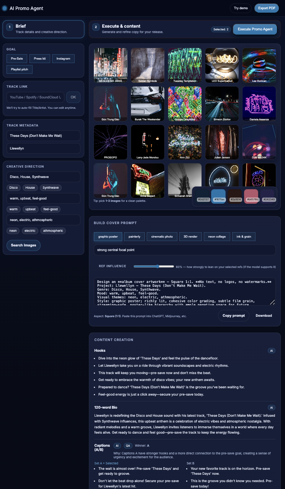

# AI Promo Agent


A polished, production‑style prototype for **music release promotion**. The app helps artists, labels, and marketers go from a raw brief to **platform‑aware copy**, **A/B‑tested captions**, a **7‑day promo plan**, a **cover prompt for any AI image model**, and a **clean exportable PDF** — in minutes.

> ⚠️ **Preview / concept**: This is a functional preview that demonstrates how an AI‑assisted promo tool could feel. It’s intended for evaluation only (no warranties) and outputs may require review.


---

## Table of Contents

- [AI Promo Agent](#ai-promo-agent)
  - [](#)
  - [Table of Contents](#table-of-contents)
  - [Why this exists](#why-this-exists)
  - [Key features](#key-features)
  - [UX walkthrough](#ux-walkthrough)
  - [Architecture overview](#architecture-overview)
    - [Front‑end (Next.js App Router)](#frontend-nextjs-app-router)
    - [AI prompting strategy](#ai-prompting-strategy)
    - [Content critique \& refinement](#content-critique--refinement)
    - [Image search \& palette extraction](#image-search--palette-extraction)
    - [PDF export](#pdf-export)
  - [Directory structure](#directory-structure)
  - [Setup \& installation](#setup--installation)
    - [Prerequisites](#prerequisites)
  - [Configuration](#configuration)
  - [Run \& develop](#run--develop)
  - [Build \& deploy](#build--deploy)
  - [Accessibility \& responsiveness](#accessibility--responsiveness)
  - [Performance \& reliability](#performance--reliability)
  - [Roadmap](#roadmap)
  - [FAQ](#faq)
  - [License](#license)

---

## Why this exists

Music promo work is repetitive: summarize a track succinctly, tailor the message to **goal + platform** (e.g., pre‑save vs pre‑sale; Instagram vs TikTok), keep tone on‑brand, and package everything clearly for teams. This prototype shows how **structured inputs + AI** can turn a creative brief into consistent, high‑quality promotion assets — fast.

---

## Key features

- **End‑to‑end flow**
  - 1) **Brief** → Track metadata & creative direction
  - 2) **Curate** → Search reference images; auto‑extract **5‑color palette**
  - 3) **Execute Promo Agent** → Generate **Hooks**, **120‑word Bio**, **Captions A/B**, **7‑Day Plan**
  - 4) **Cover Prompt** → Copy/paste into any AI image model
  - 5) **Export PDF** → Share a tidy, brand‑colored document

- **Goal presets (platform‑aware)**  
  `pre_sale`, `pre_save`, `press_kit`, `instagram`, `tiktok`, `playlist_pitch`  
  Each preset applies guardrails (e.g., *do not mention TikTok* in an Instagram run; *do not say pre‑save* in a pre‑sale run).

- **A/B captions + QA**  
  Two distinct caption sets (`A` and `B`) plus a lightweight **QA/critique** step that scores content, picks a **winner**, and suggests refinements. If quality < threshold, the system **auto‑refines** with the critique notes.

- **No‑emoji hardener**  
  Outputs are sanitized to remove emojis and problematic symbols to keep PDFs and professional decks tidy.

- **Super clean UI**  
  Responsive layout, consistent spacing, labeled sections, and refined color use derived from the selected **palette**.

- **Intro/disclaimer overlay**  
  Accessible, dismissible overlay explaining how to try the demo and how the tool works.

---

## UX walkthrough

1. **Brief**  
   Paste a streaming link to prefill Title/Artist (or type them) and add **Genre, Mood, Themes**.
2. **Curate & Palette**  
   Use **Search Images** to retrieve references; pick **1–3**. The app extracts a **5‑color palette** that drives the on‑page branding and the PDF accent colors.
3. **Execute Promo Agent**  
   Generates **Hooks (aka “Loglines/Taglines”)**, a **120‑word Bio**, **Captions A/B** (winner chosen via QA), and a **7‑day plan** tailored to the selected **goal**.
4. **Cover Prompt**  
   A richly structured prompt you can paste into **ChatGPT, Midjourney,** etc. A **Ref Influence** slider conveys how strongly the image model should use your references (if supported).
5. **Export PDF**  
   Once executed, export a brand‑colored PDF with clear spacing, readable sections, and simple badges (AI / QA).

> **Try Demo**: Generates a pre‑filled brief and randomly selects three images so every demo has a slightly different vibe. (It no longer auto‑executes the Promo Agent — you decide when to run it.)

---

## Architecture overview

### Front‑end (Next.js App Router)

- **Framework**: Next.js 14+, React, TypeScript
- **Key components**:
  - `app/page.tsx` — main UI, header, brief, image grid, palette, **Prompt Composer**, **Execute**, **CopyPanel** (content), and **Export PDF**.
  - `CopyPanel` — neatly spaced content groups with badges and A/B captions.
  - `PaletteBlock`, `SectionHead`, `ChipPreview` — presentational helpers.
- **Styling**: `globals.css` defines a compact design system (tokens, cards, buttons, chips, image tiles). Carefully refactored to avoid duplication and maintain a **professional consistent look** across desktop and mobile.

### AI prompting strategy

- **Server route**: `app/api/compose/route.ts`
- **Model**: `gpt-4o-mini` (configurable)
- **System message**:
  - Establishes role (“expert music marketing copywriter and creative director”)
  - Enforces tone, concision, and palette as *vibe cues* (not literal hex mentions)
  - **Goal preset** + **goal guards** applied to *all* sections (no accidental cross‑platform mentions)
  - **JSON‑only** response schema: `loglines`, `bio120`, `captionsA`, `captionsB`, `plan`
- **No‑emoji hardener**: Post‑processes AI output to strip emojis/surrogates and normalize whitespace before rendering or exporting.

### Content critique & refinement

- **Server route**: `app/api/critique/route.ts` (lightweight heuristic/LLM)
- Scores, lists issues, picks **A/B winner**, and returns **winner reasons**.
- If score < threshold, we **re‑compose** with critique notes for a cleaner second pass.

### Image search & palette extraction

- **Server route**: `app/api/images/route.ts` (provider‑agnostic wrapper — Unsplash/Pexels, etc.)
- **Square‑first** UX: grid crops visually to square for a cohesive gallery.
- **Palette**: downsampled image pixels → simple **k‑means** to get 5 representative colors. These define `--brand`, `--accent`, and `--neutral` roles used across UI and PDF.

### PDF export

- **Client**: `jsPDF`
- Clean, consistent **vertical rhythm** with section and group spacers, colored underlines, badges (“AI”, “QA”), palette swatches, moodboard grid, content sections, A/B captions **stacked vertically**, and optional QA notes.
- Exports to `Title_promo.pdf`.

---

## Directory structure

```
app/
  api/
    compose/route.ts           # AI content generation
    critique/route.ts          # QA + A/B winner selection
    images/route.ts            # Reference image search
    ingest/route.ts            # (Optional) Autofill Title/Artist from a link
  page.tsx                     # Main UI
lib/
  ccopy.ts                     # Fallback copy generators
  types.ts                     # Shared TypeScript types
public/
  ...                          # Static assets
styles/
  globals.css                  # Design tokens + components
```

---

## Setup & installation

```bash
# 1) Clone
git clone https://github.com/your-org/ai-promo-agent.git
cd ai-promo-agent

# 2) Install
pnpm install   # or: npm install / yarn

# 3) Configure env (see below)

# 4) Run
pnpm dev       # http://localhost:3000
```

### Prerequisites

- Node.js 18+ (or the version your Next.js target recommends)
- pnpm / npm / yarn

---

## Configuration

Create `.env.local`:

```bash
# OpenAI
OPENAI_API_KEY=sk-...

# Image provider (pick your own and reflect in /api/images)
IMAGES_PROVIDER=unsplash         # or pexels, etc.
UNSPLASH_ACCESS_KEY=...          # if using Unsplash
PEXELS_API_KEY=...               # if using Pexels

# Optional
NEXT_PUBLIC_APP_NAME="AI Promo Agent"
```

> The app uses an **in‑memory cache** (Map) for demos. For production, switch to Redis/KV (see notes in `compose/route.ts`).

---

## Run & develop

```bash
pnpm dev
# Next.js dev server on http://localhost:3000
```

- **Try Demo**: Fills the brief (genre/mood/themes) and randomly selects **3** images. You can change parameters and re‑run.
- **Execute Promo Agent**: Generates the content. The **Export PDF** button is enabled *only after* execution with palette + selections in place.
- **Cover Prompt**: Copy to clipboard or download `.txt`. The **Ref Influence** slider expresses how strongly the image model should lean on your selected refs (if supported).

---

## Build & deploy

```bash
pnpm build
pnpm start
```

- Recommended: **Vercel** (works out of the box with Next.js App Router)
- Ensure all required env vars are set in your deployment platform
- Replace the in‑memory cache with hosted KV/Redis for scale and resilience

---

## Accessibility & responsiveness

- Uses semantic roles (`role="dialog"`, `aria-modal`, `aria-label`), focus‑visible rings, and keyboard‑reachable controls.
- **Intro overlay** is dismissible (`Esc`, button) and can be re‑shown via query string (`?intro=1`) or by clicking the **brand refresh** button.
- **Mobile polish**: header actions pinned to the right, grid/cards/inputs tighten spacing, palette overlay flows under the grid, slider and buttons remain usable on small screens.

---

## Performance & reliability

- **Cache**: Response cache keyed by brief+palette+goal+refineNotes (swap to KV in prod).
- **Minimal client work**: Image palette extraction downsamples aggressively; k‑means runs on small sample sizes.
- **PDF**: Efficient, text‑first; images added in “FAST” mode in a 4×3 grid.
- **Guards**: Export is blocked until the user has selections, a palette, and AI content.

---

## Roadmap

- Multi‑track projects and versioning
- Collaboration (comments, approvals, and status)
- Asset management (upload your own refs; copyright checks)
- More platform presets (YouTube Shorts, Twitch, Spotify Canvas, etc.)
- Analytics & A/B outcomes tracking
- KV/Redis cache + persistence for briefs and results
- i18n for multi‑language promo

---

## FAQ

**Why “Hooks” instead of “Loglines”?**  
“Hooks” is more familiar in promo/marketing; both are short, punchy one‑liners that sell the idea quickly.

**What does “Ref Influence” mean?**  
A hint to your image model about how strongly to lean on your selected reference images (if supported). **Low%** = looser inspiration. **High%** = closer to the reference look/texture/palette.

**Why no emojis?**  
PDF layouts can break or look inconsistent with emojis. We strip them for clean, professional exports.

---

## License

This preview is provided **as‑is** for evaluation purposes only; **no warranties**. 
If you want to collaborate with me just reach out. I'd be happy to talk options. 
Check the licence file for more information.